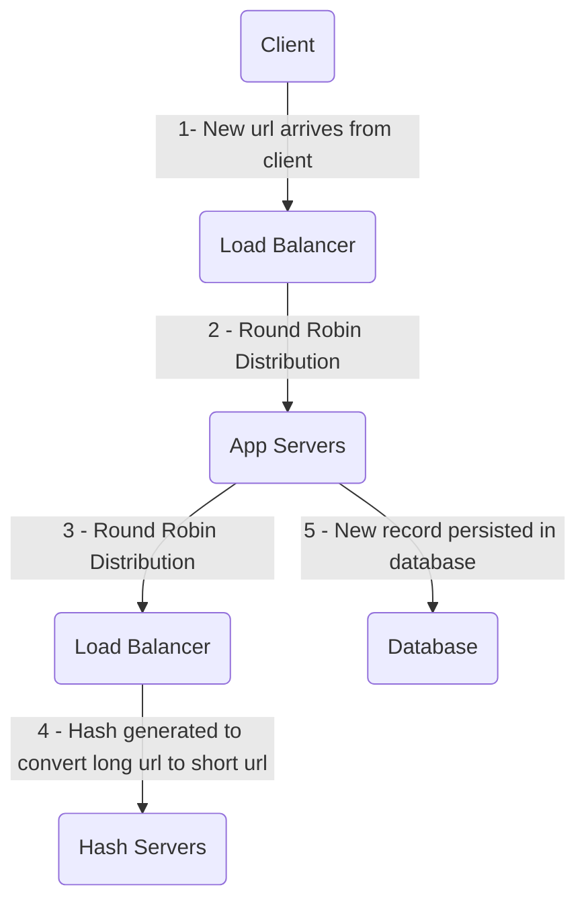
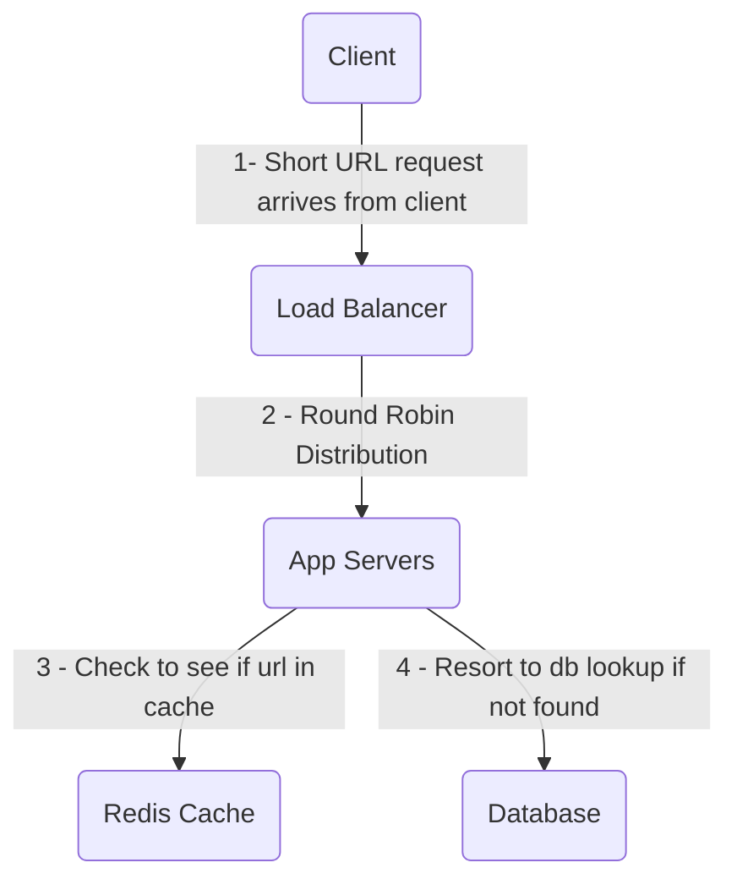

# Overview

This is a simple project to practice system design of a Url Shortening service

## Run the project

### Backend

I have containerized the entire solution to make development easy and to allow for horizontal scaling in the future. In order to run all the containers in a single server, you just have to run this command:
```
docker-compose up --build
```

This should launch four containers:
- Cache: A redis container to serve as a read-path cache
- DB: A container to host my postgres database
- App: The container which contains the core api logic
- Hash: The container which is used to retrieve hashes of long url strings

### Frontend

The frontend is a next.js application that can be deployed with the following commands:
```
yarn install
yarn dev
```

## Test the project

Testing the project is straightforward. Since the docker compose allows me to expose certain ports, you can query the API with the following commands:

### Create a short URL
This command will create a new entry for a short url, if it has not been recorded in the past. If the short url was already recorded, it will return a 409 error indicating that the record already exists.
```
curl -X PUT localhost:9000/create -H "Content-Type: application/json" -d '{"long_url": "http://www.google.com"}'
```
### Lookup a short URL
This command currently performs a redirect to the long url, if it is found. If it is not found, it will return a 404 error.
```
curl -X GET localhost:9000/lookup -H "Content-Type: application/json" -d '{"short_url": "http://www.short.url/ed646a3334ca891fd3467db131372140"}'
```
### Run the test suite
In order to make testing easier, I create a small bash script that creates three short urls, performs a successful lookup, and performs an invalid lookup. This script can be ran while the docker containers are up with the following command:
```
bash test.sh
```

## System Design

I designed this system to be scalable beyond a single server. In this section, I will walk through some design considerations and how I would scale this into a multi-server infrastructure. 

### Database

#### Schema Design
The current schema of the application supports creating and looking up short urls.
| Column     |      Type     |  Nullable |
|------------|:-------------:|----------:|
| id (pk)    |    INTEGER    |  NOT NULL |
| short_url  |  VARCHAR(64)  |           |
| long_url   |  VARCHAR(255) |  NOT NULL |
| created_at |   TIMESTAMP   |  NOT NULL |
| last_login |   TIMESTAMP   |  NOT NULL |

#### Schema extension
In the future, if there is a need to track users, the existing design can be extended with this `Account` table:

| Column     |      Type      |  Nullable |
|------------|:--------------:|----------:|
| id (pk)    |    INTEGER     |  NOT NULL |
| name       |  VARCHAR(32)   |           |
| email      |  VARCHAR(2048) |  NOT NULL |
| created_at |   TIMESTAMP    |  NOT NULL |
| last_login |   TIMESTAMP    |  NOT NULL |

I would then add a foreign key to the `Url` table to perform one-to-many mapping from accounts to urls.

### Capacity Planning
This system is designed to be ready heavy. I am making the assumption that a user will create a long url and then visit the short url a handful of times with most accesses being just once.

#### Assumptions:
- 10 million Daily Active Users
- Time to persist data: `3 years`
- Read to write ratio: `100:1`

#### Traffic
| Description  | Value   |
| :----------- | -------:|
| DAU (Write)  | 10M     |
| QPS (Write)  | 100     |
| Read:Write   | 100:1   |
| QPS (Read)   | 10,000  | 

#### Storage
| Description  | Size (Bytes)   |
| :----------- | --------------:|
| Short URL    | 64             |
| Long URL     | 2,048          |
| Created At   | 10             |
| Expires At   | 10             |

In total, rounding up, each record is approximately 2.2KB. Considering there are 10M writes a day and we need to persist data for 3 years, we would need approximately 24 TB of storage. With a replication factor of 3 for main and replication servers, we would need a total storage size of approximately 75 TB.
```
10M writes/day * 2.2KB/URL * 365 days * 3 years = 24TB
```

Considering there are 10k reads per second or approximately 1B reads per day, we can use the 80/20 rule to determine the size of the cache we would need if we set the TTL for each cache record to 1 day:
```
1B reads/day * 2.2KB/URL * 0.2 = 440GB/day
```

### High Level System Design
In order to scale up the deployment of this application, I have put the core logic for the application separate from the hashing algorithm. This would allow me to deploy multiple containers for each component in something like Amazon EKS. 

For the load balancer, I would use a round robin since other strategies like consistent hashing or modulo-hash would cause certain servers to become overwhelmed if multiple users were trying to shorten the same long url.

#### Write path



#### Read Path



